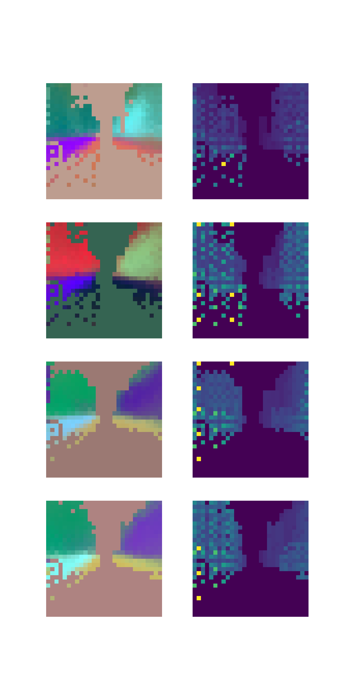

# V2P: Voxel-to-Pixel CUDA Projection Module
## Introduction
The implementation of CUDA projection module from voxel grid coordinate {V} frame to camera coordinate frame. The projection module also considers occlusions by only using the nearest projected voxel to the same pixel coordinate.

## Installation
```
git clone https://github.com/yunjinli/voxel-to-pixel.git
cd voxel-to-pixel
pip install .
```
## Usage
```
from voxel_to_pixel import VoxelToPixel

coors = torch.load("assets/voxel_indices.pt").float().to(device="cuda")
feats = torch.load("assets/voxel_feats.pt").float().to(device="cuda")
batch_size = int((coors[:, 0].max() + 1).item())

param_dict = {
    'fx': 21.10563392,
    'fy': 28.14084532,
    'cx': 14.08286292,
    'cy': 14.12856648,
    'h': 28,
    'w': 28,
    'R': [[0, -1, 0], [0, 0, -1], [1, 0, 0]],
    'voxel_size': [1.5714285714285714, 1.5714285714285714, 0.7857142857142857],
    'pcd_range': [0, -22, -4, 44, 22, 18],
}

v2p = VoxelToPixel(**param_dict).to('cuda')

proj_feats, inv_depth_maps = v2p(feats, coors, batch_size)
```
The visualization of the PCA projected feature maps and inverse depth map should look like the followings.


